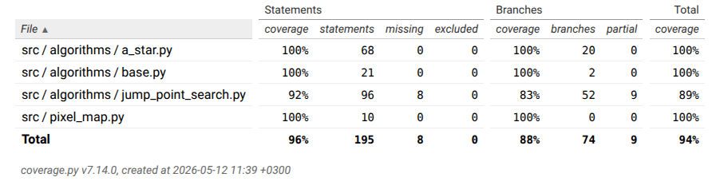

# Testausdokumentti

## Testien Kattavuus

Voit luoda kattavuusraportin komennolla

    pytest --cov=src --cov-branch; coverage html

## Mitä on Testattu

Projektissa on kattavat yksikkötestit, joiden lisäksi on integraatiotestejä jotka testaavat:

- Algoritmit löytävät reitin helpolla kartalla, ilman esteitä.

- Algoritmit eivät löydä reittiä tilanteessa, jossa maaliin ei pääse.

- JPS ja A\* löytävät saman pituisen reitin satunnaisesti valitulla lähdöllä ja maalilla 50 x 50 tyhjällä kartalla, joka ajetaan 10 kertaa.

- JPS ja A\* heuristiikkafunktiot antavat samat arvot.

Lisäksi algoritmien suorituskykyä testataan ajamalla algoritmit 100 kertaa visualisoinnin yhteydessä, visualisoinnissa käytettävällä kartalla.

Kaikki paitsi suorituskyky testit käyttävät pytest kirjastoa. Suorituskyky testeissä hyödynnetään timeit moduulia.

## Miten Testit Suoritetaan

Voit ajaa testit komennolla

    pytest tests

Suorituskykyä testataan sovellusta ajettaessa.
